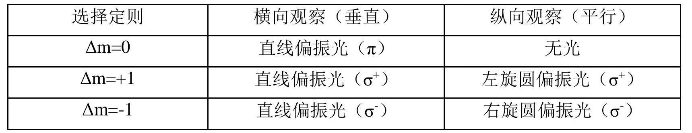
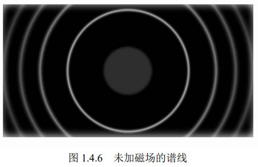
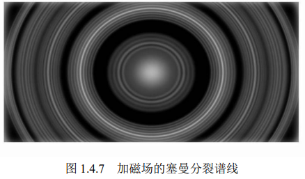
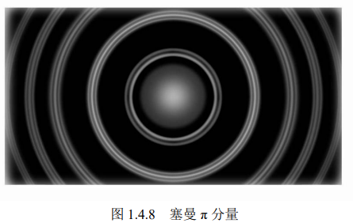
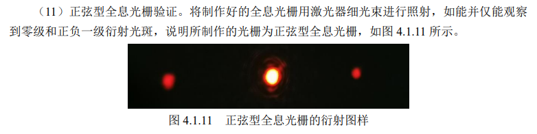
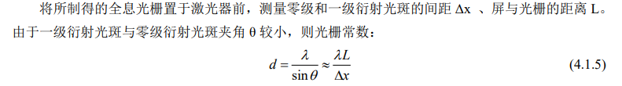
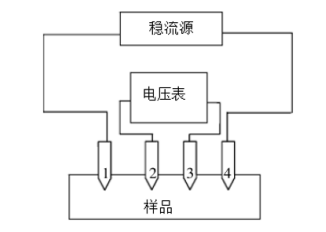
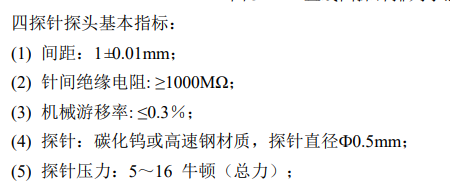
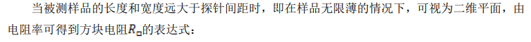
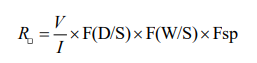

# 塞曼效应实验

- 原子中电子的运动导致原子具有磁矩，在磁场中，原子磁矩与外磁场的作用将引起原子能级的 变化，其大小可以表示为:
  $$\Delta E = mg \mu_BB$$
  式中m为总量子数在磁场方向的投影，$\mu_B = \frac{eh}{4\pi m_g}$为玻尔磁子，$g$是朗德因子
- 无磁场时的一个能级，设其总角动量量子数为$J$在外磁场的作用下分裂成$(2J+1)$个值
- 塞曼效应垂直与平行磁场方向观察结果
- $\pi$分量三条谱线$\sigma$分量六条谱线
- 具体图像 
  
- 图像分析 
  
  ***从内到外分别是K级，K-1级.... 同一级次半径越小对应波长越大。***
# 全息光栅的制作
- 光栅常数 $d$ 即为相邻光缝之间的距离 $d=a+b$。 $a$是透光缝宽度，$b$ 是不透光缝宽度。
- 空间频率 $f=\frac{1}{d}$
- 检测是否为正弦型全息光栅  **所以看到3个光斑**
- **可能会有用*  （衍射后）测光栅常数
# 四探针法测量半导体电阻率

- 计算方法 若四探针等间距分布（间隔为$S$），则电阻率 $\rho = 2\pi S(\frac{\Delta V}{I})$。$\Delta V$是23间点位差 $I$是14间电流。
  ****可能要注意*** ：这一公式是在半无限大样品的基础上导出的，实用中必须满足样品厚度及边缘与探针之间的最近距离大于四倍探针间距， 这样才能使该式具有足够的精确度。
- **探针间距** **$1\pm0.01mm$**(或者是1mm?)
  
- 可以测薄层方块电阻 满足

  

